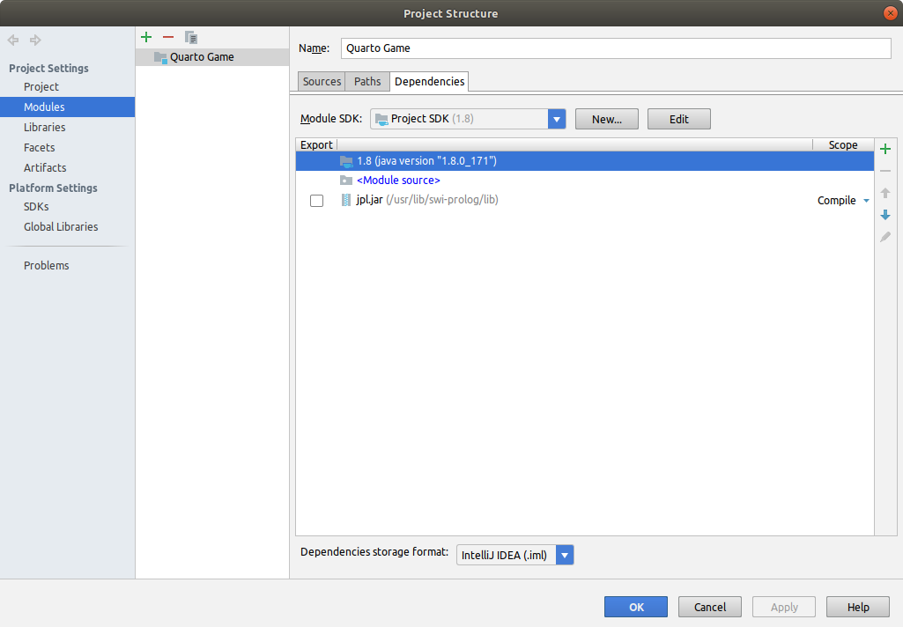

# Quarto

A modified version of original Quarto game. it's place three game which has a 3×3 board and 8 pieces. Each piece has three attributes: color, shape, and
height.

## How It Works
- Game implemented to be played in **Human vs AI mode**
- Players move alternatively, placing one piece on the board; once inserted, pieces cannot be move.
- Player win when complete a line of 3 pieces that are similar at least about one of the three attributes.
- The game finishes in a draw when nobody reaches the objective after placing the 8 pieces.

## Minimax Algorithm
- It's is a decision-making algorithm used to implement basic **AI**
- It's choosing the next move for a player.
- Search a tree of all possible moves in order to find the move that produces the best result.
- Maximize your position whilst minimize your opponent’s.
- For example: a tree of possible moves in **Tic Tac Toe** game 
- [More Explantation](https://www.geeksforgeeks.org/minimax-algorithm-in-game-theory-set-1-introduction/)

## To Run

1. Add <code>jpl.jar</code> to project dependencies.  
2. Add <code>-Djava.library.path=/usr/lib/swi-prolog/lib</code> in VM options from **run configuration** in IDE if you are using **Linux**. 
if your are using **Windows** <code>-Djava.library.path=C://Programs Files/swipl/lib</code> 
  

